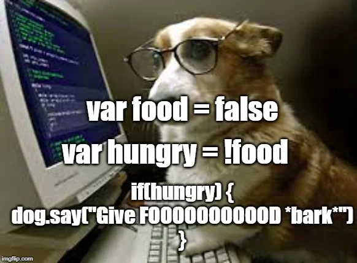

Content comes from [submodulesIES-entertainment](https://github.com/wisniewski-mateusz/submodulesIES-entertainment) repository and Google after typing `dog programming memes`.

---

## 1. Meme

---

## 2. Meme

---

## 3. Meme

